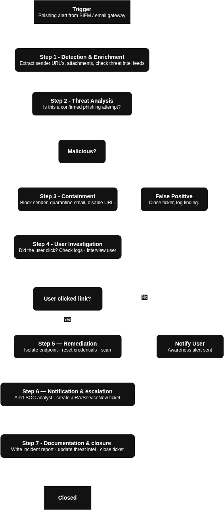

# What is SOAR?

**SOAR** stands for **Security, Orchestration, Automation and Response.**

> Imagine your SOC gets 500 alerts per day. Analysts can't manually investigate every single one. SOAR is like having a smart robot assistant that handles repetitive tasks automatically — so your team focuses only on what matters.

SOAR has 3 pillars:

<table>
  <tr>
    <td><strong>Pillar</strong></td>
    <td><strong>What it means</strong></td>
    <td><strong>Example</strong></td>
  </tr>
  <tr>
    <td>Orchestration</td>
    <td>Connecting different security tools together</td>
    <td>Connecting your SIEM + firewall + ticketing system</td>
  </tr>
  <tr>
    <td>Automation</td>
    <td>Running tasks without human intervention</td>
    <td>Auto-blocking an IP when malware is detected</td>
  </tr>
  <tr>
    <td>Response</td>
    <td>Taking action on threats</td>
    <td>Isolating an infected machine automatically</td>
  </tr>
</table>

## What is SOAR Playbook?

A Playbook is a step by step automated workflow that tells SOAR exactly what to do when a specific threat is detected. Lets think of it like a recipie:
- **Trigger** ➡️ something happens (e.g., phishing email detected)
- **Steps** ➡️ defined actions run in order
- **Outcome** ➡️ threat is contained, ticket is created, analyst is notified

## General playbook structure:

```bash
TRIGGER (Alert/Event)
    ↓
DETECTION & ENRICHMENT (gather more info)
    ↓
ANALYSIS (Is this a real threat?)
    ↓
CONTAINMENT (Stop the spread)
    ↓
REMEDIATION (Fix the damage)
    ↓
NOTIFICATION & DOCUMENTATION (Report it)
```

Now lets try creating a playbook for detecting and preventing **Phishing Email Attack**. But before we build the playbook we need to understand what happens during a phishing attack so the playbook makes sense:

1. Attacker sends a malicious email (Fake link, malicious attachment, credential harvesting).
1. Email lands in employee's inbox.
1. Employee clicks the link or opens the attachment.
1. Attacker gains the access/ steal credentials/ drops malware.
1. SOC gets an alert ➡️ Playbook kicks in.   



**Playbook Name**: Phishing email incident response.  
**Version**: 1.0  
**Severity**: High  
**Type**: Automated + Human assisted  
