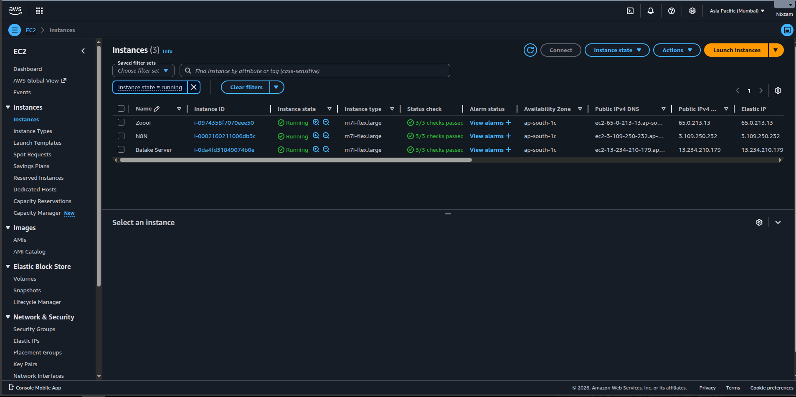

# SOAR Lab

**Submited By**: Nizamudheen KN  
**Date**: 24-04-2026  
**Subject**: SOAR Automation  

---

So Inorder to set up the lab I use AWS because my system was having low specs. In AWS i created 3 Ubuntu 24.04 Server Instance. The instance called `zoooi` running wazuh manager in docker. The instance called `n8n` is running my n8n in docker. The instance called `balake server` running as an endpont with the wazuh agent installed. This is my setup and it is easy to set it up in AWS. 

